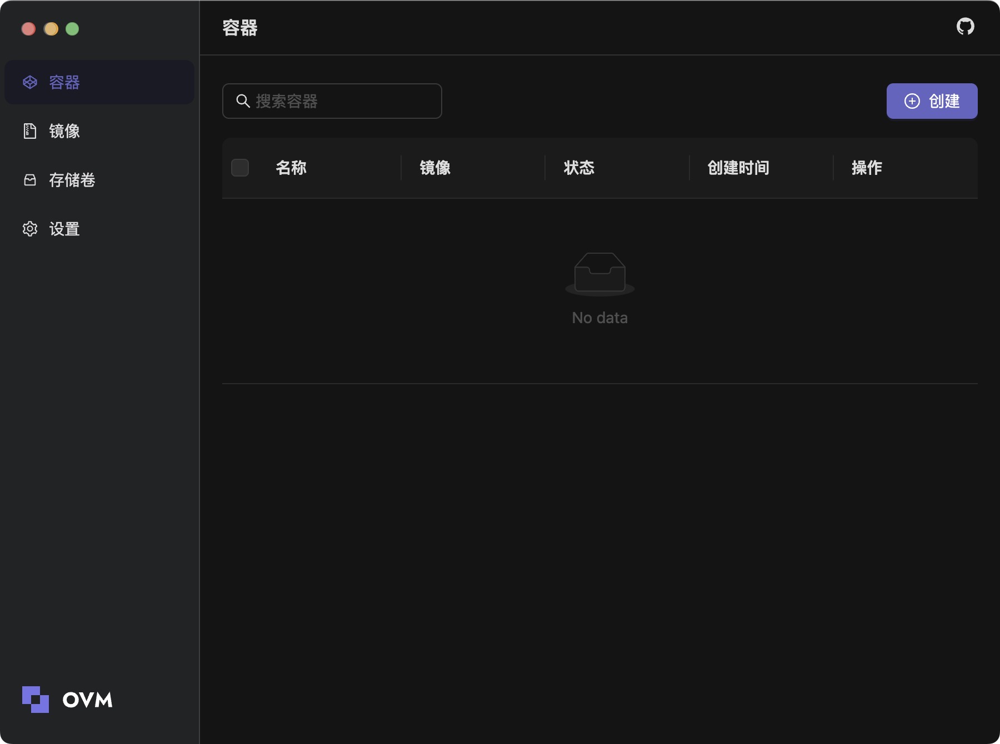

<p align="center">
    
</p>

<div align="center">
    <h1>OVM desktop</h1>
    <p>OVM is a fast, lightweight, and easy-to-use application for running Docker containers. Use our Docker Desktop alternative to develop quickly.</p>
</div>

<div align="center">
    <h1>OVM</h1>
    <p>Project OVM is the Windows and macOS client of OVM</p>
    
</div>

## Features

## Quickstart

### Installation

> If you don't have pnpm installed:
>
> ```bash
> npm i -g pnpm
> ```

Clone or fork this project, at project root run:

```bash
pnpm i
```

### Build and run OVM Electron client

Run the following commands at the root of the repository to build and run OVM Electron client.

```shell
pnpm dev:electron
```

You can use one of the following methods to package your executable:

- Run `pnpm run pack` at project root to package based on current system.

### Build and run OVM Web client

Run the following command at the root of the repository to build and run OVM web client.

```shell
pnpm dev:web
```

Alternatively, run the following command:

```shell
cd ./web/ovm-web/ && pnpm dev
```

UI and business logic are separated in OVM. You can view and develop OVM components UI via Storybook. You can either visit the ([Online address][ovm-storybook]) or run `pnpm storybook` at the root of the repository to run Storybook locally.

## References

## Related Projects

## Contributing

## Code Contributors

Thank you to all the people who already contributed to OVM!

## Disclaimer

## License

Copyright © OOMOL Corporation. All rights reserved.

Licensed under the [MIT license](LICENSE).

When using the OVM or other GitHub logos, be sure to follow the [GitHub logo guidelines][github-logo].
